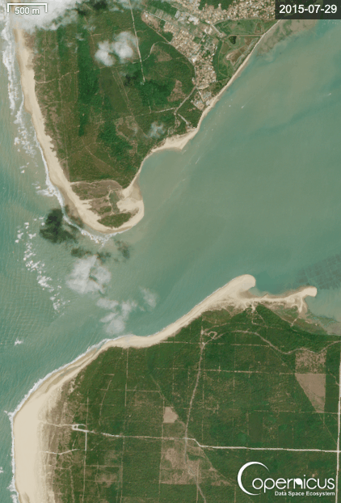
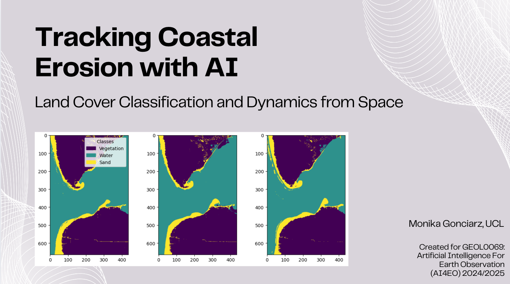

<table>
  <tr>
    <td align="center">
      <h2>Tracking Coastal Erosion with AI: Land Cover Classification and Dynamics from Space <a id="top"></a> 
</div></h2>
      <p>This project utilizes SENTINEL-2 imagery and advanced machine learning techniques - K-means clustering and Convolutional Neural Networks (CNNs) - to detect and monitor coastal erosion and land use transformations in the Saint-Trojan coastal zone of Western France between 2015 and 2025.</p>
    </td>
    <td>
      
    </td>
  </tr>
</table>


<br>  
<br>  

<details>
<summary>Table of Contents</summary>
  
1. [Project Introduction](#1-project-introduction)
2. [Problem Background](#2-problem-background)
3. [The SENTINEL-2 Satellite](#3-the-sentinel-2-satellite)
4. [Machine Learning Methodologies:](#4-machine-learning-methodologies)
   - [K-Means Clustering](#bullet-k-means-clustering)
   - [Convolutional Neural Network (CNN)](#bullet-convolutional-neural-network-cnn)
5. [Datasets Used](#5-datasets-used)
6. [Usage](#6-usage)
   - [Environmental Cost](#bullet-environmental-cost)
   - [Video Tutorial](#bullet-video-tutorial)
7. [Results](#7-results)
8. [Acknowledgements](#8-acknowledgments)
    - [References](#references)
    - [Contact](#contact)

</details>

---

<br>  


## 1. Project Introduction

This project is the final assignment for the GEOL0069 AI4EO course at UCL, aimed at exploring the application of machine learning techniques in Earth Sciences. The focus of this project is on utilizing unsupervised and supervised learning to identify coastal erosion patterns through satellite imagery. SENTINEL-2 data is employed for its high spatial resolution and relevance in coastal monitoring. The primary algorithms used for classification in this project are K-means clustering (for unsupervised classification) and the Convolutional Neural Network (CNN) method (for feature extraction and land type identification), which are applied to analyze and monitor land cover changes over time.


<br>  

## 2. Problem Background


<br>  

## 3. The SENTINEL-2 Satellite

FIGURE ON S2

<br>  


## 4. Machine Learning Methodologies:

### <a name="bullet-k-means-clustering"></a>• K-Means Clustering

FIGURE ON K-MEANS

<br>  


### <a name="bullet-convolutional-neural-network-cnn"></a>• Convolutional Neural Network (CNN)

FIGURE ON CNN

<br>  


## 5. Datasets Used


<br>  

## 6. Usage

```python
pip install rasterio
```

### <a name="bullet-environmental-cost"></a>• Environmental Cost


### <a name="bullet-video-tutorial"></a>• Video Tutorial

Here is a video demonstration of the code, detailing its functionality and operation.

[](https://youtu.be/rqpMsphdrzo)


<br>  

## 7. Results


<br>  

## 8. Acknowledgments

This project was developed for GEOL0069 (Artificial Intelligence For Earth Observation) 2024/2025 at UCL, led by the module team: Dr Michel Tsamados, Weibin Chen, and Connor Nelson.

<br>  


## References
*Copernicus Browser.* (n.d.). (Accessed 2025), from Copernicus Browser website https://browser.dataspace.copernicus.eu

Tsamados M. & Chen W. *Regression Techniques for Predictive Analysis.* GEOL0069 GitHub Page. (2022). (Accessed 2025), from https://cpomucl.github.io/GEOL0069-AI4EO/Chapter1_Regression.html

Tsamados M. & Chen W. *Unsupervised Learning.* GEOL0069 GitHub Page. (2022). (Accessed 2025), from https://cpomucl.github.io/GEOL0069-AI4EO/Chapter1%3AUnsupervised_Learning_Methods.html


<br>  

## Contact

Project Author: Monika Gonciarz monika.gonciarz.22@ucl.ac.uk

Project Link: https://github.com/monikagonciarz/AI4EO_final_project

<br>
<br>


<div style="text-align: right;">
  
  [(Back to top)](#top)
</div>


