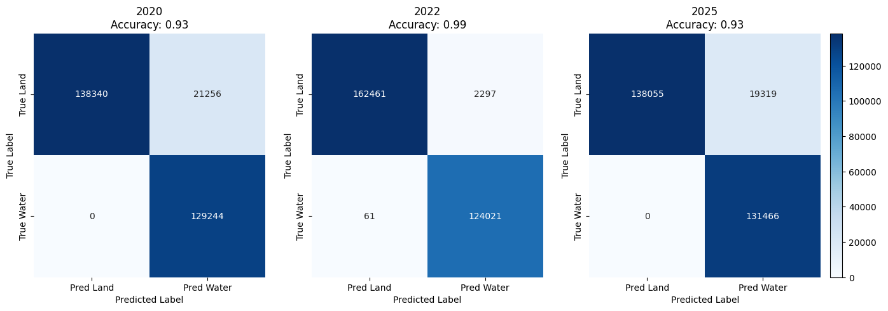
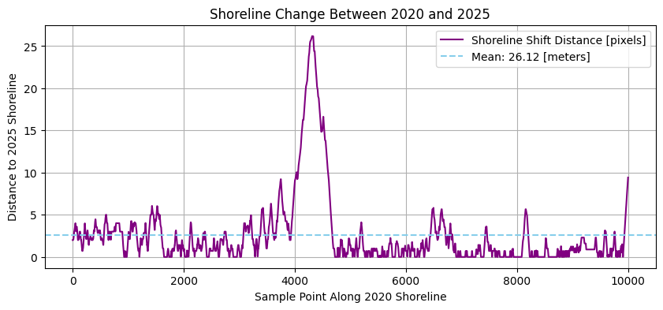

<table>
  <tr>
    <td align="center">
      <h2>Tracking Coastal Erosion with AI: Land Cover Classification and Dynamics from Space <a id="top"></a> 
</div></h2>
      <p>This project utilizes SENTINEL-2 imagery and an advanced machine learning technique (K-means clustering) to detect and monitor coastal erosion and land cover transformations in the Saint-Trojan coastal zone of Western France between 2020 and 2025.</p>
    </td>
    <td>
      
    </td>
  </tr>
</table>


<br>  
<br>  

<details>
<summary>Table of Contents</summary>
  
1. [Project Introduction](#1-project-introduction)
2. [Problem Background](#2-problem-background)
3. [The SENTINEL-2 Satellite](#3-the-sentinel-2-satellite)
4. [Machine Learning Methodologies:](#4-machine-learning-methodologies)
   - [K-Means Clustering](#bullet-k-means-clustering)
   - [IRIS](#bullet-intelligently-reinforced-image-segmentation-iris)
5. [Datasets Used](#5-datasets-used)
6. [Usage](#6-usage)
   - [Video Tutorial](#bullet-video-tutorial)
   - [Environmental Cost](#bullet-environmental-cost)
7. [Results](#7-results)
8. [Acknowledgements](#8-acknowledgments)
    - [References](#references)
    - [Contact](#contact)

</details>

---

<br>  


## 1. Project Introduction

This project is the final assignment for the GEOL0069 AI4EO course at UCL, aimed at exploring the application of machine learning techniques in Earth Sciences. The focus of this project is on utilizing unsupervised learning to identify coastal erosion patterns through satellite imagery. SENTINEL-2 data is employed for its high spatial resolution and relevance in coastal monitoring. The primary algorithm used for classification in this project is K-means clustering, an unsupervised classification method, which is applied to analyze and monitor land cover changes over time.


<br>  

## 2. Problem Background

Coastal erosion is a critical environmental issue, threatening ecosystems, human livelihoods, and infrastructure. Traditional monitoring methods, such as field surveys, are costly and time-intensive, making large-scale and real-time analysis difficult. Satellite remote sensing, particularly through high-resolution imagery like SENTINEL-2, provides a solution by offering frequent, accessible, and detailed data on coastal regions (Phiri et al., 2020).


#### Why this study area? 

In the two decades leading up to 2007, the coastline of Saint-Trojan on Île d'Oléron in the Gulf of Biscay (figure on the right, adapted from Manawa, 2024) has faced significant erosion, with rates of 4 to 6 meters per year (Musereau et al., 2007). This has raised both environmental and economic concerns, as the beach and dunes are vital for the region’s tourist industry. Although previous studies have used probabilistic models to assess erosion risks, these models have been based on historical data and need refinement for broader application. A chosen area of around 30 km^2 (figure on the left, adapted from Nicklin, 2015) is suitable for studying coastal erosion as it captures diverse coastal features while being manageable for data analysis.


<br>

<p align="center">
  
</p>

<br>


#### Why this timeframe?

No comprehensive studies have been conducted in the area since 2007 (Musereau et al., 2007), making it an intriguing opportunity for analysis now. Given the increasing impact of climate change and more frequent storms, the period from 2020 to 2025 is critical for improving coastal erosion prediction. This decade is essential for enhancing our understanding of coastal dynamics and improving erosion forecasting tools, as significant erosion has been observed there in that timeframe.

#### Why use satellite data?

Advances in satellite imagery and machine learning have opened new possibilities for monitoring coastal change with greater accuracy and efficiency. By utilizing Sentinel-2 data along with algorithms like K-means clustering, this project identifies land cover types and tracks erosion over time. These automated techniques provide scalable insights into coastal dynamics, helping inform better decision-making for preservation and management.


The goal is to notice the impacts of recent coastal erosion through accurate, data-driven tools for monitoring erosion and supporting decision-making. Ultimately, this project demonstrates the potential of AI in Earth observation, studying coastal erosion and environmental change.


<br>  

## 3. The SENTINEL-2 Satellite

SENTINEL-2 is part of the Copernicus programme, developed by the European Union and managed by the European Space Agency (ESA). It consists of two twin satellites in a sun-synchronous orbit, working in tandem to monitor land surface changes across the globe. SENTINEL-2 is designed to provide detailed and frequent imagery with a high revisit time of 5 days at the Equator, which is essential for tracking environmental changes. The satellite's observation capabilities are particularly geared towards monitoring vegetation, soil, water cover, and coastal areas (Copernicus Dataspace, n.d.) - exactly what is needed for this project!

#### Multi-Spectral Instrument (MSI)

SENTINEL-2's core imaging technology is the Multi-Spectral Instrument (MSI), which captures data across 13 spectral bands. These bands have varying spatial resolutions: four bands at 10 meters, six bands at 20 meters, and three bands at 60 meters (Copernicus Dataspace, n.d.). This multi-resolution imaging allows SENTINEL-2 to offer detailed observations suitable for various applications, including land monitoring, agriculture, forestry, and disaster management. The MSI is key to providing a comprehensive view of Earth's surface conditions.

<br>

#### Key Features

• ***High Resolution:*** SENTINEL-2's MSI offers high spatial resolution, with bands capturing features at 10m, 20m, and 60m depending on the spectral band.

• ***Frequent Revisit:*** The satellites are phased at 180° to provide a 5-day revisit time at the Equator, ensuring up-to-date imagery for monitoring dynamic environments.

• ***Wide Swath:*** With a 290 km wide swath, SENTINEL-2 covers a large area in each pass, making it efficient for monitoring vast regions.

<br>

For my project, I have utilized data collected by SENTINEL-2 satellites, particularly the images and information gathered through the MSI. This data has been essential in analyzing land cover changes and monitoring various environmental parameters across different regions.

<br>

<p align="center">
  
</p>


<br>  


## 4. Machine Learning Methodologies:

### <a name="bullet-k-means-clustering"></a>• K-Means Clustering

K-means is an unsupervised machine learning algorithm used to partition data into 'k' distinct clusters based on feature similarity. It’s especially useful when prior knowledge about the data’s structure is unavailable. Through iterative refinement, K-means assigns each data point to the nearest cluster center (centroid) and then updates those centroids until the configuration stabilizes (Tsamados & Chen, 2022).

#### Key Components of K-means:
1. ***Choosing k:*** The number of clusters must be pre-defined. Selecting an optimal 'k' often involves extensive testing and evaluating metrics.
2. ***Centroid Initialization:*** Starting positions for centroids can influence the final results.
3. ***Assignment Step:*** Each data point is assigned to the cluster with the nearest centroid (commonly using Euclidean distance).
4. ***Update Step:*** Centroids are recalculated as the mean of all data points assigned to them.
5. ***Iteration:*** The assignment and update steps repeat until the centroids no longer significantly change or a maximum number of iterations is reached.
6. ***Convergence:*** The algorithm stops when the intra-cluster variance is minimized and cluster memberships stabilize.


<br>

<p align="center">
  
</p>


<br>  


### <a name="bullet-intelligently-reinforced-image-segmentation-iris"></a>• Intelligently Reinforced Image Segmentation (IRIS)

IRIS (Intelligently Reinforced Image Segmentation) is a machine learning technique designed for remote sensing image classification, particularly in the context of land cover classification. Unlike deep learning models such as CNNs, IRIS employs Gradient Boosting Decision Trees (GBDT), a powerful machine learning method that combines the predictive power of multiple weak models (decision trees) into a strong one. GBDT works by iteratively training decision trees, where each tree corrects the mistakes of the previous one. This sequential process enables IRIS to handle complex relationships between features in satellite images, making it well-suited for classifying land cover types like water, vegetation, and sand (ESA-PhiLab Github Page, n.d.).


#### Key Components of IRIS
1. ***Gradient Boosting Decision Trees (GBDT):*** IRIS uses decision trees that are trained in a boosting manner to improve classification accuracy. Each tree in the sequence tries to correct the errors made by the previous trees.
2. ***Feature Engineering:*** IRIS leverages various image features, such as spectral bands (e.g. Red, Green, Blue, Near-Infrared) and indices (e.g. NDVI or NDWI), to train the decision trees. These features help the model learn distinct characteristics of different land cover types.
3. ***Ensemble Learning:*** By combining many decision trees, IRIS forms a strong, accurate classifier capable of handling complex, high-dimensional remote sensing data.
4. ***Iterative Training:*** The model is trained iteratively, with each new tree focused on areas where the previous trees made mistakes, leading to continuous improvement in classification performance.
5. ***Robustness to Variability:*** IRIS’s ability to adapt to various environmental conditions (e.g. seasonal variations) and its use of ensemble methods help the model produce more reliable results in real-world applications.


<br>

<p align="center">
  
</p>


<br> 

This makes IRIS particularly effective for classifying satellite imagery, as it can handle the complexity and variability inherent in remote sensing data while providing accurate and interpretable land cover classifications. An **IRIS mask** is the output of this segmentation, where each pixel is assigned a class label (water = blue, vegetation = green, sand = tan). These masks are used to compare classification methods, such as K-Means, against a reference mask (ground truth) to assess accuracy. The masks for each year were manually created using the IRIS web application (as seen below).


<br>

<p align="center">
  
</p>


<br>  


## 5. Datasets Used

The datasets used in this project are the 10m resolution SENTINEL-2 Level 2A (L2A) datasets. The analysis focuses on a 30 km^2 section of the Saint-Trojan Coastal Area on the island of d'Oléron, France, with data from three key years: 2020, 2020, and 2025. This region was selected for its susceptibility to coastal erosion, making it a prime candidate for studying land cover changes and erosion patterns over time.


Due to the large size of the datasets, they are not included here. However, individuals interested in using the same data can download them from the Copernicus Browser, which requires a free account for access.

#### To retrieve the datasets for the Saint-Trojan Coastal Area:

1. Visit the [Copernicus Dataspace Browser](https://browser.dataspace.copernicus.eu).
2. Create an account.
3. In the search tab, enter the following filenames to locate the relevant SENTINEL-2 datasets:

   • SENTINEL-2 L2A data for 2020:
   ```plaintext
   S2B_MSIL2A_20200727T105619_N0500_R094_T30TXR_20230430T011345.SAFE
    ```

   
      • SENTINEL-2 L2A data for 2022:
   ```plaintext
   S2A_MSIL2A_20220712T105631_N0510_R094_T30TXR_20240723T232251.SAFE
   ```

      • SENTINEL-2 L2A data for 2025:
   ```plaintext
   S2C_MSIL2A_20250407T105641_N0511_R094_T30TXR_20250407T163015.SAFE
   ```
4. Download the files and unzip them in your local file system for use in this project.


<br>

To run the IRIS comparison, make sure to **download the "IRIS" folder** provided in this repository and upload it to your Google Drive in the same location as the main notebook. This folder includes the three land cover masks generated using IRIS, the corresponding .tif files, and a config.json file required for mask generation. For a step-by-step guide on how the masks were created, refer to the instructions available here: [GEOL0069 Github](https://cpomucl.github.io/GEOL0069-AI4EO/Chapter%201%3AIRIS.html) (Tsamados & Chen, 2022).


<br>  

## 6. Usage

The first thing to do after downloading the **Coastal_Erosion_ML.ipynb** notebook is to mount the Google Drive on Google Colab:

```python
from google.colab import drive
drive.mount('/content/drive')
```


Then, the following software needs to be installed in order to run the code:

```python
pip install rasterio
```


Next, a set of functions must be loaded:

```python
import rasterio
import numpy as np
import os
import matplotlib.pyplot as plt
from pyproj import Transformer
from rasterio.windows import from_bounds
from matplotlib.patches import Rectangle
from sklearn.cluster import KMeans
from sklearn.preprocessing import StandardScaler
import seaborn as sns
from sklearn.metrics import confusion_matrix, accuracy_score, classification_report, ConfusionMatrixDisplay
from skimage import measure
from shapely.geometry import LineString
import cv2
```


Then, the base file paths for the datasets used in this project are defined. These will be referenced throughout the notebook, so it is crucial to update these paths to match the locations on your device.


The coordinates of the study area 'box' are also defined, and will be referenced throughout the notebook:

```python
lon_min, lat_max = -1.24991, 45.82923  # Top-left corner
lon_max, lat_min = -1.19206, 45.77035  # Bottom-right corner
```

<br>

• To begin the analysis, we create a **Normalized Difference Water Index** (NDWI) 'water mask'.


The NDWI is a common technique used in remote sensing to detect the presence of surface water in satellite imagery (McFeeters, 1996). It works by comparing how much green light (band 3) and near-infrared (NIR, band 8) light is reflected from the Earth's surface. Water tends to reflect more green light and absorb NIR, so the difference between these two bands helps highlight water features.


The formula is: **NDWI = (Green - NIR) / (Green + NIR)**


While it is a fast method for identifying water bodies, it does have some limitations. It can struggle in urban areas or when water is mixed with high levels of sediment, often confusing these with other land types (Gao, 1996). In this project, NDWI is a reference method to benchmark our results against. Our aim is to improve upon it using more robust and adaptive machine learning techniques, especially in challenging environments where NDWI alone may fall short.

<br>

<p align="center">
  
</p>

<br>


• Later, another index is introduced: the **Normalized Difference Vegetation Index** (NDVI) to create a 'vegetation mask'. 


The NDVI is a widely used vegetation indicator that helps assess the presence and health of green vegetation using satellite imagery. It compares the difference between near-infrared light (band 8, which vegetation strongly reflects) and red light (band 4, which vegetation absorbs).


The formula is: **NDVI = (NIR - Red) / (NIR + Red)**


High NDVI values typically indicate dense, healthy vegetation, while lower values suggest sparse or stressed plant cover. NDVI is especially useful in land cover classification, agriculture, and environmental monitoring due to its simplicity and effectiveness.

<br>

<p align="center">
  
</p>

<br>


Afterwards, the K-Means classification was performed. Subsequently, the classification results were compared with IRIS masks to further analyse the data.

<br>

### <a name="bullet-video-tutorial"></a>• Video Tutorial

Click the image below to explore the video demonstrating the **Coastal_Erosion_ML.ipynb** notebook, providing an overview of the code's functionality and operation.

<br>


[](https://youtu.be/3XS5vaFIjDo)


<br>
<br>


### <a name="bullet-environmental-cost"></a>• Environmental Cost


To reflect the resource use behind this notebook, I included a section estimating its environmental cost, including energy consumption and carbon emissions. The code uses Python libraries like psutil, time, and matplotlib. 

To generate the full environmental impact report, it is crucial to run the two setup cells at the start of the notebook, one which defines the necessary function and the one below which initialises a timer and begins tracking system resource usage:

```python
impact_monitor = ColabEnvironmentalImpact()
```

At the end, you can run the final cell to display your personalised environmental report (example included below), complete with visual comparisons and CO₂ equivalents:

```python
impact_monitor.generate_report()
```

<br>

<p align="center">
  
</p>

<br>

Initially, the code tracks CPU and memory usage during runtime, then rephrases it into an estimated energy usage (in kWh) and CO₂ emissions (in grams) based on average carbon intensity figures. To make the results more relatable, it calculates equivalents such as:


• *How far could you drive a car to emit the same CO₂?*

• *How many times could you charge a smartphone?*

• *How many days would it take a tree to absorb that much CO₂?*


While the direct notebook computation is captured moderately well, it's important to note that interactions with AI models (such as the aid in creating labels in IRIS), downloading datasets, or reading online resources aren't easy to quantify, but they definitely add to the footprint.

The use of AI to support building this notebook arguably makes the environmental cost higher. It's a reminder to consider the trade-offs and try to use computing resources meaningfully.


<br>  

## 7. Results


K-Means was initially set to classify the study area into 2 dominant classes (land and water). The output was evaluated against an NDWI-based reference mask and the true RGB composite:

<br>

<p align="center">
  
</p>

<br>

Below are the confusion matrices and corresponding accuracies. Each matrix demonstrates how well the clustering algorithm distinguishes between land and water, showing solid agreement with the NDWI-based baseline across all years, but best for 2022.

<br>

<p align="center">
  
</p>

<br>


Then, expanding the analysis to 3 clusters (water, vegetation, and sand) provided more detailed land cover classification, identifying transitional areas such as sandy beaches and vegetated dunes. A visual inspection suggests that this classification better reflects the coastal complexity. A K-Means classification of 3 clusters with NDWI and NDVI masks taken into account is provided here: 


<br>

<p align="center">
  
</p>

<br>


To evaluate the performance of K-means clustering for land cover classification, we compared its results with both the original satellite imagery (RGB composites) and the IRIS-generated masks. This visual comparison helps assess how accurately the unsupervised K-means approach aligns with the more guided segmentation provided by IRIS, which uses gradient boosting decision trees for smarter boundary detection.


<br>

<p align="center">
  
</p>

<br>


To better understand the separability of classes, **feature space clustering plots** (inspired by the Balaji, 2022 paper) were created using classification values from K-Means computed with all 3 bands and both the NDWI and NDVI masks. The plots below show the pixel distribution and cluster centers in 2D space:

<br>

<p align="center">
  
</p>

<br>

These plots help demonstrate how well different land covers cluster in spectral space, validating the choice of bands and number of clusters.

<br>

## Final takeaways
<br>


An average **shoreline shift of 26 meters** over the total study period from 2020 to 2025 was found, which  indicates **significant coastal erosion**. This means that, on average, the shoreline has retreated 26 meters inland, suggesting a substantial loss of land to the sea. This translates to a 5.2-meter annual shift, which affirms the expectations of an annual coastal erosion of 4 to 6 m found in literature (Musereau et al., 2007). Such a shift can have serious implications for ecosystems, infrastructure, and communities located near the coast, highlighting the urgency of monitoring and managing coastal change.


<br>

<p align="center">
  
</p>

<br>

A change in land use was quantified at 4.43% from a confusion matrix presented below. This represents a change in approximately **1.33 km²** within a 30 km² study area over the observed period from 2020 to 2025. This percentage reflects the **transformation of land coverage**, which includes the *largest shift of 4071 pixels from sandy areas to water* (meaning some areas which were sandy beaches in 2020 are underwater in 2025), which confirms the fact that coastal erosion had a significant impact on this area. Even a relatively small percentage change in land use within this area can have considerable environmental, economic, and social implications, highlighting the importance of monitoring and managing land use to ensure sustainable development and resource conservation.

<br>

<p align="center">
  
</p>


<br>  

## 8. Acknowledgments

This project was developed for GEOL0069 (Artificial Intelligence For Earth Observation) 2024/2025 at UCL, led by the module team: Dr Michel Tsamados, Weibin Chen, and Connor Nelson.

<br>  


## References
Balaji, K. (2022). Machine learning algorithm for feature space clustering of mixed data with missing information based on molecule similarity. Journal of Biomedical Informatics, 125, 103954.

*Copernicus Browser.* (n.d.). (Accessed 2025), from the Copernicus Browser website. https://browser.dataspace.copernicus.eu

*Copernicus Dataspace: SENTINEL-2.* (n.d.). (Accessed 2025), from the Copernicus Dataspace website. https://dataspace.copernicus.eu/explore-data/data-collections/SENTINEL-data/SENTINEL-2

*ESA-PhiLab.* (n.d.) (Accessed 2025). https://github.com/ESA-PhiLab/iris

Gao, B. C. (1996). NDWI—A normalized difference water index for remote sensing of vegetation liquid water from space. Remote sensing of environment, 58(3), 257-266.

Manawa. *Top 7 outdoor activities on the Ile d’Oléron.* (2024). Retrieved April 9, 2025, from Manawa website: https://www.manawa.com/en/articles/top-7-outdoor-activities-on-the-ile-doleron

McFeeters, S. K. (1996). The use of the Normalized Difference Water Index (NDWI) in the delineation of open water features. International journal of remote sensing, 17(7), 1425-1432.

Musereau, J., Regnauld, H., & Planchon, O. (2007). *Vulnerability of coastal dunes to storms: development of a damage prediction model using the example of Saint-Trojan (Île d'Oléron, France).* Climatologie, 4, 145-166. https://climatology.edpsciences.org/articles/climat/full_html/2007/01/climat20074p145/climat20074p145.html

Nicklin, M. W. (2015). *Better than Elba: Echoes of Napoleon on idyllic French islands.* Retrieved April 9, 2025, from The Washington Post website: https://www.washingtonpost.com/lifestyle/travel/better-than-elba-echoes-of-napoleon-on-idyllic-french-islands/2015/05/28/b195ff02-fe36-11e4-8b6c-0dcce21e223d_story.html

Phiri, D., Simwanda, M., Salekin, S., Nyirenda, V. R., Murayama, Y., & Ranagalage, M. (2020). *SENTINEL-2 data for land cover/use mapping: A review.* Remote sensing, 12(14), 2291. https://www.mdpi.com/2072-4292/12/14/2291

Tsamados M. & Chen W. (2022). *Regression Techniques for Predictive Analysis.* GEOL0069 GitHub Page. (Accessed 2025). https://cpomucl.github.io/GEOL0069-AI4EO/Chapter1_Regression.html

Tsamados M. & Chen W. (2022). *Unsupervised Learning.* GEOL0069 GitHub Page. (Accessed 2025). https://cpomucl.github.io/GEOL0069-AI4EO/Chapter1%3AUnsupervised_Learning_Methods.html


<br>  

## Contact

Project Author: Monika Gonciarz monika.gonciarz.22@ucl.ac.uk

Project Link: https://github.com/monikagonciarz/AI4EO_final_project

<br>
<br>


<div style="text-align: right;">
  
  [(Back to top)](#top)
</div>


