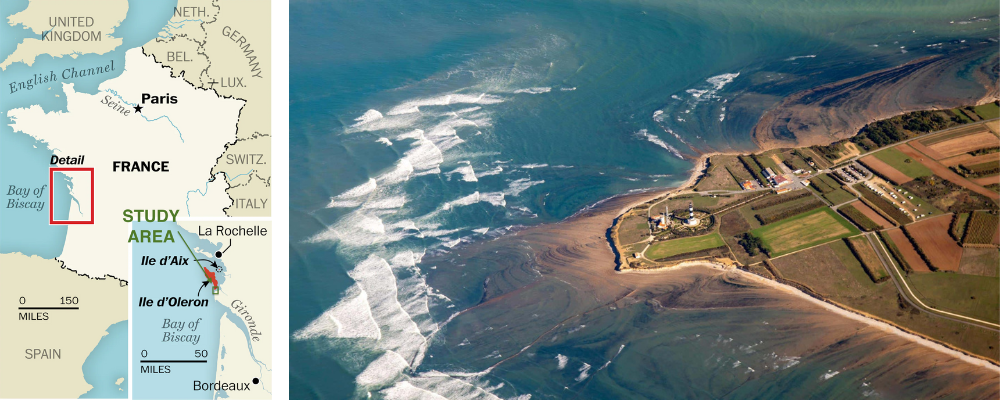

<table>
  <tr>
    <td align="center">
      <h2>Tracking Coastal Erosion with AI: Land Cover Classification and Dynamics from Space <a id="top"></a> 
</div></h2>
      <p>This project utilizes SENTINEL-2 imagery and advanced machine learning techniques - K-means clustering and Convolutional Neural Networks (CNNs) - to detect and monitor coastal erosion and land use transformations in the Saint-Trojan coastal zone of Western France between 2015 and 2025.</p>
    </td>
    <td>
      
    </td>
  </tr>
</table>


<br>  
<br>  

<details>
<summary>Table of Contents</summary>
  
1. [Project Introduction](#1-project-introduction)
2. [Problem Background](#2-problem-background)
3. [The SENTINEL-2 Satellite](#3-the-SENTINEL-2-satellite)
4. [Machine Learning Methodologies:](#4-machine-learning-methodologies)
   - [K-Means Clustering](#bullet-k-means-clustering)
   - [Convolutional Neural Network (CNN)](#bullet-convolutional-neural-network-cnn)
5. [Datasets Used](#5-datasets-used)
6. [Usage](#6-usage)
   - [Environmental Cost](#bullet-environmental-cost)
   - [Video Tutorial](#bullet-video-tutorial)
7. [Results](#7-results)
8. [Acknowledgements](#8-acknowledgments)
    - [References](#references)
    - [Contact](#contact)

</details>

---

<br>  


## 1. Project Introduction

This project is the final assignment for the GEOL0069 AI4EO course at UCL, aimed at exploring the application of machine learning techniques in Earth Sciences. The focus of this project is on utilizing unsupervised and supervised learning to identify coastal erosion patterns through satellite imagery. SENTINEL-2 data is employed for its high spatial resolution and relevance in coastal monitoring. The primary algorithms used for classification in this project are K-means clustering (for unsupervised classification) and the Convolutional Neural Network (CNN) method (for feature extraction and land type identification), which are applied to analyze and monitor land cover changes over time.


<br>  

## 2. Problem Background

Coastal erosion is a critical environmental issue, threatening ecosystems, human livelihoods, and infrastructure. Traditional monitoring methods, such as field surveys, are costly and time-intensive, making large-scale and real-time analysis difficult. Satellite remote sensing, particularly through high-resolution imagery like SENTINEL-2, provides a solution by offering frequent, accessible, and detailed data on coastal regions (Phiri et al., 2020).


#### Why this study area? 

In the two decades leading up to 2007, the coastline of Saint-Trojan on Île d'Oléron in the Gulf of Biscay (figure on the right, adapted from Manawa, 2024) has faced significant erosion, with rates of 4 to 6 meters per year (Musereau et al., 2007). This has raised both environmental and economic concerns, as the beach and dunes are vital for the region’s tourist industry. Although previous studies have used probabilistic models to assess erosion risks, these models have been based on historical data and need refinement for broader application. A chosen area of around 30 km^2 (figure on the left, adapted from Nicklin, 2015) is suitable for studying coastal erosion as it captures diverse coastal features while being manageable for data analysis.


  


#### Why this timeframe?

No comprehensive studies have been conducted in the area since 2007 (Musereau et al., 2007), making it an intriguing opportunity for analysis now. Given the increasing impact of climate change and more frequent storms, the period from 2015 to 2025 is critical for improving coastal erosion prediction. This decade is essential for enhancing our understanding of coastal dynamics and improving erosion forecasting tools, as significant erosion has been observed there in that timeframe.

#### Why use satellite data?

Advancements in satellite imagery and machine learning techniques offer new opportunities to monitor and predict coastal changes with higher accuracy. By utilizing SENTINEL-2 satellite data, alongside machine learning algorithms like K-means and CNNs, more precise predictions of erosion events can be made, aiding in better coastal management and preservation. By applying K-means clustering and Convolutional Neural Networks (CNN), we aim to classify land cover types and detect changes related to erosion over time. These machine learning techniques allow for automated and scalable analysis, providing insights into coastal dynamics and land use changes.


The goal is to enhance coastal management by providing more accurate, data-driven tools for monitoring erosion and supporting decision-making. Ultimately, this project demonstrates the potential of AI in Earth observation, offering an innovative approach to studying coastal erosion and environmental change.


<br>  

## 3. The SENTINEL-2 Satellite

SENTINEL-2 is part of the Copernicus programme, developed by the European Union and managed by the European Space Agency (ESA). It consists of two twin satellites in a sun-synchronous orbit, working in tandem to monitor land surface changes across the globe. SENTINEL-2 is designed to provide detailed and frequent imagery with a high revisit time of 5 days at the Equator, which is essential for tracking environmental changes. The satellite's observation capabilities are particularly geared towards monitoring vegetation, soil, water cover, and coastal areas (Copernicus Dataspace, n.d.).

#### Multi-Spectral Instrument (MSI)

SENTINEL-2's core imaging technology is the Multi-Spectral Instrument (MSI), which captures data across 13 spectral bands. These bands have varying spatial resolutions: four bands at 10 meters, six bands at 20 meters, and three bands at 60 meters (Copernicus Dataspace, n.d.). This multi-resolution imaging allows SENTINEL-2 to offer detailed observations suitable for various applications, including land monitoring, agriculture, forestry, and disaster management. The MSI is key to providing a comprehensive view of Earth's surface conditions.


FIGURE ON S2


#### Key Features

• ***High Resolution:*** SENTINEL-2's MSI offers high spatial resolution, with bands capturing features at 10m, 20m, and 60m depending on the spectral band.

• ***Frequent Revisit:*** The satellites are phased at 180° to provide a 5-day revisit time at the Equator, ensuring up-to-date imagery for monitoring dynamic environments.

• ***Wide Swath:*** With a 290 km wide swath, SENTINEL-2 covers a large area in each pass, making it efficient for monitoring vast regions.


For my project, I have utilized data collected by SENTINEL-2 satellites, particularly the images and information gathered through the MSI. This data has been essential in analyzing land cover changes and monitoring various environmental parameters across different regions.


<br>  


## 4. Machine Learning Methodologies:

### <a name="bullet-k-means-clustering"></a>• K-Means Clustering

K-means is an unsupervised machine learning algorithm used to partition data into 'k' distinct clusters based on feature similarity. It’s especially useful when prior knowledge about the data’s structure is unavailable. Through iterative refinement, K-means assigns each data point to the nearest cluster center (centroid) and then updates those centroids until the configuration stabilizes (Tsamados & Chen, 2022).

#### Key Components of K-means
1. ***Choosing k:*** The number of clusters must be pre-defined. Selecting an optimal 'k' often involves extensive testing and evaluating metrics.
2. ***Centroid Initialization:*** Starting positions for centroids can influence the final results.
3. ***Assignment Step:*** Each data point is assigned to the cluster with the nearest centroid (commonly using Euclidean distance).
4. ***Update Step:*** Centroids are recalculated as the mean of all data points assigned to them.
5. ***Iteration:*** The assignment and update steps repeat until the centroids no longer significantly change or a maximum number of iterations is reached.
6. ***Convergence:*** The algorithm stops when the intra-cluster variance is minimized and cluster memberships stabilize.


FIGURE ON K-MEANS

<br>  


### <a name="bullet-convolutional-neural-network-cnn"></a>• Convolutional Neural Network (CNN)

CNNs are a type of deep learning model specifically designed to process and analyze image data. They operate by converting input images into numerical vectors and passing them through multiple layers of filters that learn to detect patterns and features such as edges, textures, and shapes (Tsamados & Chen, 2022). This makes CNNs particularly well-suited for classification tasks like land cover mapping using satellite imagery. Their ability to automatically extract spatial features, handle high-dimensional complex data, and adapt to variations such as lighting or seasonal changes makes them especially powerful tools in remote sensing and Earth observation applications.

#### Key Components of CNNs
1. ***Convolutional Layers:*** CNNs are comprised of neuron layers which include input, hidden, and output layers.
2. ***Activation Functions:*** Introduce non-linearity (for example using ReLU) to capture complex relationships.
3. ***Pooling Layers:*** Downsample feature maps to reduce size and overfitting.
4. ***Fully Connected Layers:*** Combine learned features for final predictions by connecting every neuron in every layer.
5. ***Training Process:*** Weights are optimized through backpropagation to minimize classification error.


FIGURE ON CNN

<br>  


## 5. Datasets Used

The datasets used in this project are SENTINEL-2 Level 2A (L2A) datasets. The analysis focuses on a 30 km^2 section of the Saint-Trojan Coastal Area on the island of d'Oléron, France, with data from three key years: 2015, 2020, and 2025. This region was selected for its susceptibility to coastal erosion, making it a prime candidate for studying land cover changes and erosion patterns over time.


Due to the large size of the datasets, they are not included here. However, individuals interested in using the same data can download them from the Copernicus Browser, which requires a free account for access.

#### To retrieve the datasets for the Saint-Trojan Coastal Area:

1. Visit the [Copernicus Dataspace Browser](https://browser.dataspace.copernicus.eu).
2. Create an account.
3. In the search tab, enter the following filenames to locate the relevant SENTINEL-2 datasets:
   
      • SENTINEL-2 L2A data for 2015:
   ```plaintext
   S2A_MSIL2A_20150729T110026_N0500_R094_T30TXR_20231010T114432.SAFE
   ```
      • SENTINEL-2 L2A data for 2020:
   ```plaintext
   S2B_MSIL2A_20200727T105619_N0500_R094_T30TXR_20230430T011345.SAFE
    ```
      • SENTINEL-2 L2A data for 2025:
   ```plaintext
   S2C_MSIL2A_20250407T105641_N0511_R094_T30TXR_20250407T163015.SAFE
   ```
4. Download the files and unzip them in your local file system for use in this project.


<br>  

## 6. Usage

```python
pip install rasterio
```

### <a name="bullet-environmental-cost"></a>• Environmental Cost


### <a name="bullet-video-tutorial"></a>• Video Tutorial

Click below to explore the video demonstration, providing an overview of the code's functionality and operation.

[](https://youtu.be/rqpMsphdrzo)


<br>  

## 7. Results


<br>  

## 8. Acknowledgments

This project was developed for GEOL0069 (Artificial Intelligence For Earth Observation) 2024/2025 at UCL, led by the module team: Dr Michel Tsamados, Weibin Chen, and Connor Nelson.

<br>  


## References
*Copernicus Browser.* (n.d.). (Accessed 2025), from the Copernicus Browser website. https://browser.dataspace.copernicus.eu

*Copernicus Dataspace: SENTINEL-2.* (n.d.). (Accessed 2025), from the Copernicus Dataspace website. https://dataspace.copernicus.eu/explore-data/data-collections/SENTINEL-data/SENTINEL-2

Manawa. *Top 7 outdoor activities on the Ile d’Oléron.* (2024). Retrieved April 9, 2025, from Manawa website: https://www.manawa.com/en/articles/top-7-outdoor-activities-on-the-ile-doleron

Molnar C. (2025). *Interpretable Machine Learning: A Guide for Making Black Box Models Explainable.* https://christophm.github.io/interpretable-ml-book/cnn-features.html

Musereau, J., Regnauld, H., & Planchon, O. (2007). *Vulnerability of coastal dunes to storms: development of a damage prediction model using the example of Saint-Trojan (Île d'Oléron, France).* Climatologie, 4, 145-166. https://climatology.edpsciences.org/articles/climat/full_html/2007/01/climat20074p145/climat20074p145.html

Nicklin, M. W. (2015). *Better than Elba: Echoes of Napoleon on idyllic French islands.* Retrieved April 9, 2025, from The Washington Post website: https://www.washingtonpost.com/lifestyle/travel/better-than-elba-echoes-of-napoleon-on-idyllic-french-islands/2015/05/28/b195ff02-fe36-11e4-8b6c-0dcce21e223d_story.html

Phiri, D., Simwanda, M., Salekin, S., Nyirenda, V. R., Murayama, Y., & Ranagalage, M. (2020). *SENTINEL-2 data for land cover/use mapping: A review.* Remote sensing, 12(14), 2291. https://www.mdpi.com/2072-4292/12/14/2291

Tsamados M. & Chen W. (2022). *Regression Techniques for Predictive Analysis.* GEOL0069 GitHub Page. (Accessed 2025). https://cpomucl.github.io/GEOL0069-AI4EO/Chapter1_Regression.html

Tsamados M. & Chen W. (2022). *Unsupervised Learning.* GEOL0069 GitHub Page. (Accessed 2025). https://cpomucl.github.io/GEOL0069-AI4EO/Chapter1%3AUnsupervised_Learning_Methods.html


<br>  

## Contact

Project Author: Monika Gonciarz monika.gonciarz.22@ucl.ac.uk

Project Link: https://github.com/monikagonciarz/AI4EO_final_project

<br>
<br>


<div style="text-align: right;">
  
  [(Back to top)](#top)
</div>


